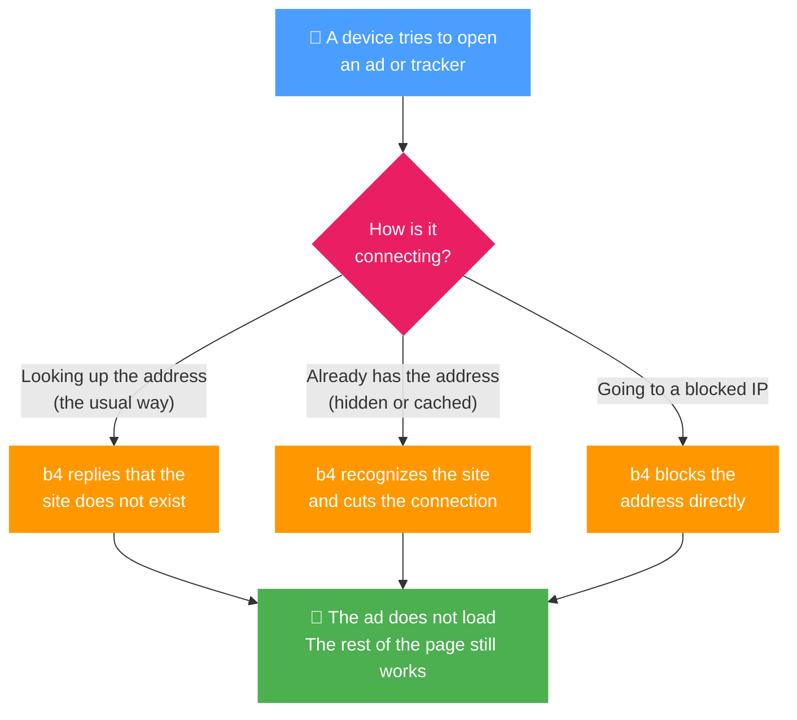

Block mode stops the traffic a set matches instead of routing it anywhere. Point a set at ad and tracker domains, unwanted IPs, or a GeoSite category, and b4 blocks them across the whole network - every LAN device and the router itself - with no output interface or upstream proxy.

It is selected in the [Routing](./routing.md) tab as the **Block** mode.

## How it works

Whatever way a device tries to reach a blocked site, b4 stops it - and only that site, so the rest of the page keeps working.



### How it works (in detail)

1. **DNS sinkhole (domains).** When a device looks up a domain in the set, b4 answers the query itself with "does not exist" (NXDOMAIN). The name never resolves to an address, so the device cannot connect to it at all. This is the primary layer, and it covers every device on the network whose DNS passes through the router.

2. **Connection block (domains).** If a device already has an address - for example it uses encrypted DNS that b4 does not see, or a cached result - b4 still reads the destination name from the TLS or QUIC handshake (the SNI) and fails the connection when that name is in the set. This keeps blocking effective even when the DNS layer is bypassed.

3. **Address block (IPs).** Targets given as plain IPs, CIDR ranges, or a GeoIP category are blocked in the firewall by destination address.

Because the first two layers work by **name**, block mode does not break unrelated sites that happen to share the same servers as a blocked host - a common problem when blocking purely by IP address on shared CDNs.

Changes apply live, without a restart.

## Setup

1. Open the set's [Routing](./routing.md) tab
2. Set the **Mode** to **Block**
3. Pick a **Block action** (see below)
4. Add the destinations to block in the set's [Targets](./targets.md)

No output interface or upstream proxy is required.

## Block actions

| Action | What the device sees |
| --- | --- |
| **Reject** (default) | The connection fails immediately - a TCP reset for TCP, or an ICMP unreachable for UDP and QUIC. Best for ads and trackers, because the page gives up on the slot right away. |
| **Drop** | The connection is silently swallowed and simply times out. Use it when you want no response sent back at all. |

## Targets

Block mode reuses the same [targeting](./targets.md) as the other routing modes:

- **Domains** - exact names or `regexp:` patterns
- **IPs and CIDR ranges** - single addresses or subnets
- **GeoSite categories** - for example `category-ads-all` for a ready-made ad and tracker list
- **GeoIP categories** - block by country or ASN

## Ready-made ad blocker

To start blocking without adding domains by hand, import a ready-made set. On the [Sets](./index.md) page create a new set, open its **Import/Export** tab, and paste the configuration below. It targets a broad list of ad and tracker domains plus the `category-ads-all` GeoSite category, with the mode already set to Block.

```json
{"b4_version":"1.65.0","name":"adblock","fragmentation":{"strategy":"none"},"faking":{"sni":false},"targets":{"sni_domains":["ad.mail.ru","advertronic.io","vu.okcdn.ru","adkernel.com","adfox.ru","nr-data.net","rubiconproject.com","adition.com","mc.yandex.com","log.strm.yandex.ru","analytics.yahoo.com","criteo.com","taboola.com","ad4m.at","1rx.io","hbx.media.net","media.net","adform.net","analyticsengine.s3.amazonaws.com","analytics.s3.amazonaws.com","ad.doubleclick.net","analytics.google.com","api.bugsnag.com","app.bugsnag.com","browser.sentry-cdn.com","app.getsentry.com","ads-api.twitter.com","log.byteoversea.com","log.fc.yahoo.com","adtech.yahooinc.com","appmetrica.yandex.ru","metrika.yandex.ru","fingerprintjs.com","px.srvcs.tumblr.com","device-metrics-us.amazon.com","cdn.cookielaw.org","consent.cookiebot.com","sdk.privacy-center.org","cdn.privacy-mgmt.com","api.impact.com","cdn.dynamicyield.com","widget.intercom.io","bnc.lt","bingads.microsoft.com","ads.microsoft.com","snap.licdn.com","ct.pinterest.com","geolocation.onetrust.com","consent.trustarc.com","app.usercentrics.eu","advertising-api-eu.amazon.com","fls-na.amazon.com","advertising.yandex.ru","ironsource.mobi","is.com","pangleglobal.com","posthog.com","o0.ingest.sentry.io","lr-ingest.com","mineralt.io","pixel.quora.com","qevents.quora.com","ads.vk.com","advertising.apple.com","ads.huawei.com","ngfts.lge.com","xp.apple.com","cmp.osano.com","consentcdn.cookiebot.com","zenaps.com","clientstream.launchdarkly.com","match.adsrvr.org","smartyads.com","adcolony.com","mouseflow.com","edge.fullstory.com","stats.wp.com","adsrvr.org","c.bing.com","app-measurement.com","cdn.segment.com","quantcast.com","rudderstack.com","snowplowanalytics.com","adjust.com","singular.net","wzrkt.com","ads.pinterest.com","ads.x.com","ads-sg.tiktok.com","tracking.rus.miui.com","cookiebot.com"],"ip":["5.255.255.77/32"],"geosite_categories":["category-ads-all"]},"enabled":true,"routing":{"enabled":true,"mode":"block"}}
```

The `category-ads-all` part needs the GeoSite database loaded - see [Targets](./targets.md).

## Scope

Block mode applies network-wide: it stops matched destinations for every device on the network and for the router itself. It needs no output interface, routing table, or proxy, so it works on any setup that the other routing modes support.

:::tip
A quick network-wide ad blocker: create a set, add the `category-ads-all` GeoSite category to its [Targets](./targets.md), set the Routing mode to **Block**, and leave the action on **Reject**.
:::

:::info
Blocking by name needs the device's DNS or its TLS/QUIC handshake to pass through the router. Traffic that leaves the network through a separate tunnel the router does not see (for example a VPN configured directly on a device) is outside b4's reach.
:::
