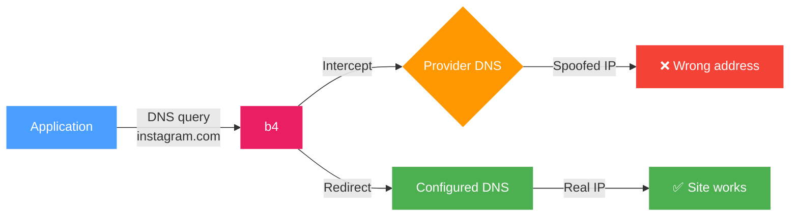
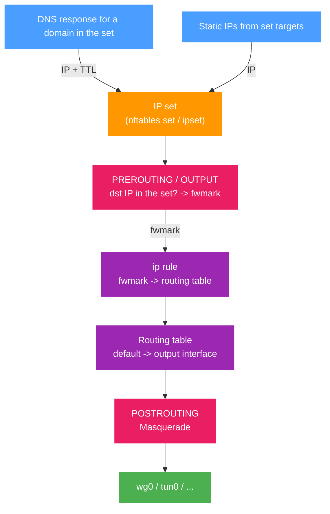

The routing tab controls how DNS queries are handled and where traffic matched by the set is sent. It has two sections: **DNS redirect** and **Traffic routing**.

## DNS redirect

Redirects DNS queries for domains in the set to a specified DNS server.

Some providers intercept DNS responses and substitute IP addresses (DNS poisoning). The connection ends up going to the wrong address even if the domain itself is not blocked directly. DNS redirect sends the query to an alternative server, bypassing the interception.



### Configuration

1. Enable **DNS redirect**
2. Pick a DNS server from the list or enter an IP manually

:::tip
If you do not know which DNS to pick, start with any server from the list other than Google DNS (8.8.8.8). Google DNS is often one of the first to be blocked by providers.
:::

### Server list

The interface shows a list of DNS servers with icons:

| Icon | Meaning |
| --- | --- |
| ⚡ | Fast - focused on low latency |
| 🛑 | AdBlock - blocks advertising domains |
| 🔒 | DNSSEC - cryptographic validation of responses |

Picking a server fills the IP into the field automatically. You can also enter any other IP manually.

:::warning
If the DNS server field is empty, the redirect will not work, even when it is turned on.
:::

### DNS query fragmentation

The **Fragment query** toggle splits the DNS packet into several parts before sending.

Used when the provider inspects the contents of DNS packets, even those to third-party servers, and blocks queries based on their contents.

:::info
Fragmentation only affects DNS queries for domains in the current set. Other DNS traffic is not modified.
:::

---

## Traffic routing

Routes traffic matched by the set through a specific network interface - for example, a VPN, WireGuard, or another tunnel.

:::tip
To **block** matched traffic instead of sending it anywhere, set the mode to Block. See [Blocking](./blocking.md).
:::

### General diagram



### How it works (in detail)

Routing uses policy-based routing - routing decisions based on packet marks:

1. **Collecting IPs.** When b4 sees a DNS response for a domain in the set, it extracts the IP addresses and adds them to an internal IP set (nftables set or ipset). IPs entered manually in the [set targets](./targets.md) are added when the configuration is loaded.

2. **Marking packets.** b4 creates firewall chains for each set:
   - **PREROUTING** (mangle) - marks forwarded traffic (from devices on the network) when the destination IP is in the set. If source interfaces are set, only traffic from those interfaces is marked.
   - **OUTPUT** (mangle) - marks traffic originating from the router itself.

3. **Policy routing.** For marked packets an `ip rule` is created: packets with a specific `fwmark` are sent to a separate routing table where the default route points at the output interface.

4. **Masquerade.** In the **POSTROUTING** (nat) chain, masquerade is applied to all marked traffic leaving through the target interface - the packet's source IP is replaced with the output interface's IP. This is required so that reply packets return through the same tunnel.

5. **Pre-resolution.** When routing is enabled, b4 immediately resolves all domains in the set targets and adds their IPs to the set. This enables routing from the first request without waiting for DNS traffic to pass through NFQUEUE.

### Routing setup

1. Enable **Routing**
2. Pick **Source interfaces** - which interfaces to intercept traffic from
3. Pick the **Output interface** - where to send the traffic


Once enabled, a flow diagram appears at the top of the section:

```text
[Source interfaces] -> B4 -> [Output interface] -> Internet
```

The diagram updates as settings change.

### Source interfaces

Define which network interfaces traffic is intercepted from for routing. Shown as clickable badges - click to toggle.

:::info
If no source interface is selected, routing applies to all traffic, including traffic originated by the router itself.
:::

If a previously chosen interface has disappeared from the system (for example, the VPN connection dropped), it is shown in red with a "stale" marker.

### Output interface

The network interface that marked traffic is sent through:

| Interface | Description |
| --- | --- |
| `wg0`, `wg1` | WireGuard tunnel |
| `tun0`, `tun1` | OpenVPN tunnel |
| `ppp0` | PPP connection |

:::warning
If the chosen output interface becomes unavailable, a warning appears. Routing will not work until the interface is back.
:::

### IP TTL (entry lifetime)

How long, in seconds, an IP obtained from a DNS response is kept in the routing IP set. When the TTL expires, the entry is removed automatically.

Default: **3600** seconds (1 hour).

IPs added manually in the set targets also use this TTL and are refreshed on every config sync.

:::tip
For stable services with constant IPs you can raise the TTL. For CDN services where IPs change frequently, lower it.
:::

### Firewall backend

b4 detects the available backend automatically:

| Backend | Requirements | Description |
| --- | --- | --- |
| **nftables** | `nft` binary | Creates the `b4_route` table with `prerouting`, `output`, `postrouting` chains. IP sets support `interval` and `timeout`. |
| **iptables + ipset** | `iptables`, `ipset` binaries | Uses the `mangle` and `nat` tables. Creates an ipset of type `hash:net` to store IPs. Also checks for `iptables-legacy`. |

:::info
The backend is chosen automatically. Systems with nftables use nftables, older systems use iptables. No manual setup is required.
:::

### FWMark and routing table

Each output interface gets assigned automatically:

- **fwmark** - packet mark (range `0x100` to `0x7EFF`)
- **routing table** - routing table number (range `100` to `2099`)

Values are computed from the interface name and stay stable across reboots. When several sets use the same output interface, they share the `fwmark` and table.

:::info
Manual `fwmark` and `table` values can be set in the configuration file. In that case automatic assignment is not used.
:::

### Cleanup

When routing is turned off or a set is removed, b4 fully removes every rule it created:

- Removes the `ip rule` and entries in the routing table
- Removes jump rules from the base chains
- Clears and removes the chains and IP sets that were created

When b4 fully stops, both backends (nftables and iptables) are cleaned to remove any leftover rules.
