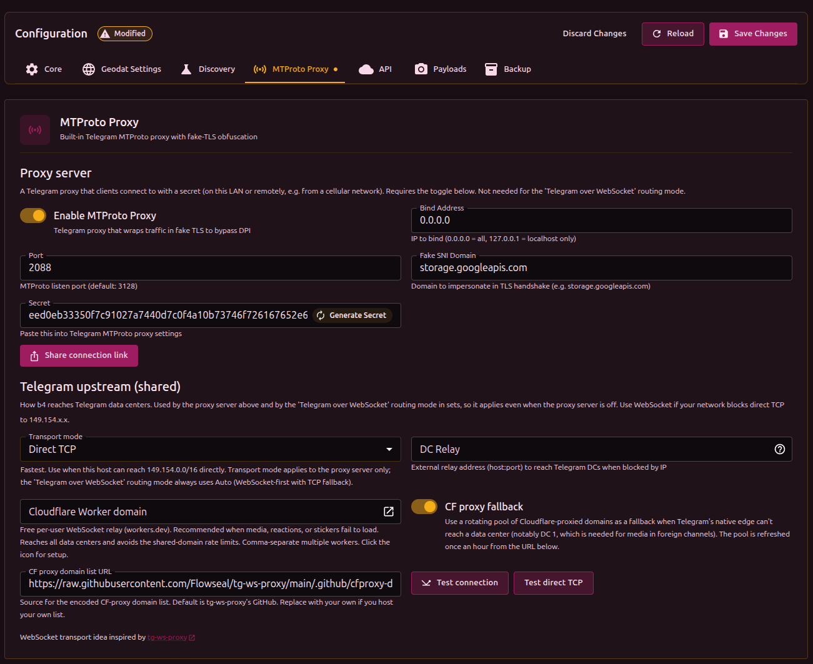

# Telegram с B4

B4 может сохранять работу Telegram в сети с цензурой двумя способами. Они независимы и могут работать одновременно:

1. **MTProto прокси-сервер** - клиент добавляет B4 как MTProto-прокси в самом приложении Telegram (по секрету). Подходит, когда устройство должно подключаться *к* B4, например телефон в сотовой сети достучивается до домашнего B4.
2. **Telegram через WebSocket (прозрачный мост)** - режим маршрутизации на уровне сета, который перехватывает трафик Telegram от устройств в локальной сети и ретранслирует его за них. Без прокси в приложении и без секрета. Подходит, чтобы починить Telegram сразу для всех устройств за B4.

Оба способа опираются на одни и те же настройки **Транспорт к Telegram** (как сам B4 достигает дата-центров Telegram), поэтому этот раздел описан один раз и относится к любому из режимов.

| Параметр                 | Прокси-сервер                                               | WebSocket-мост                      |
| ------------------------ | ----------------------------------------------------------- | ----------------------------------- |
| Где настраивается        | Settings → MTProto                                          | Режим маршрутизации сета            |
| Настройка на устройстве  | Добавить прокси и секрет в Telegram                         | Не нужна (прозрачно)                |
| Для чего                 | Одно устройство достучивается до B4 (в т.ч. удалённо/домой) | Все устройства локальной сети сразу |
| Нужен включённый MTProto | Да                                                          | Нет (независим)                     |

---

## Транспорт к Telegram (общий)

Settings → **MTProto Proxy** → **Telegram upstream**. Определяет, как B4 достигает дата-центров Telegram. Используется и прокси-сервером, и режимом WebSocket-моста, поэтому действует даже когда прокси-сервер выключен.

### Режим транспорта

- **Прямой TCP** - самый быстрый. Подходит, если хост с B4 может напрямую достучаться до `149.154.0.0/16` (например, VPS за границей).
- **Авто (WebSocket → TCP)** - сначала WebSocket через `kws*.web.telegram.org`, при неудаче - прямой TCP. Рекомендуется для сетей с цензурой.
- **Только WebSocket** - жёсткий WebSocket-транспорт, без TCP-резерва.

:::info
Выбор режима транспорта касается только **прокси-сервера**. Режим маршрутизации **WebSocket-мост** всегда использует Авто (сначала WebSocket, затем TCP).
:::

### Домен Cloudflare Worker (рекомендуемый резерв)

Если не загружаются медиа, реакции или стикеры, укажите **домен Cloudflare Worker**. Это бесплатный персональный WebSocket-релей, который вы разворачиваете на собственном аккаунте Cloudflare (`*.workers.dev`). Через него B4 достаёт любой дата-центр, поэтому он выручает DC без родного WebSocket-узла (1, 3, 5) и соединения, упёршиеся в лимиты общего пула CF. Воркер пробуется после родного узла Telegram (чтобы для DC 2/4 побеждал быстрый родной путь) и перед общим пулом CF.

Коротко о настройке:

1. Заведите бесплатный аккаунт Cloudflare.
2. В **Compute → Workers & Pages** создайте Worker из шаблона по умолчанию и задеплойте его.
3. Замените код воркера на скрипт прокси и задеплойте снова.
4. Скопируйте домен воркера вида `name-1234.username.workers.dev` в поле **домен Cloudflare Worker**. Несколько воркеров указывайте через запятую.

Убедитесь, что `cloudflare.com`, `cloudflare.dev` и `workers.dev` доступны (не заблокированы) в вашей сети.

Скрипт воркера и подробная пошаговая инструкция поддерживаются проектом tg-ws-proxy: [CfWorker.md](https://github.com/Flowseal/tg-ws-proxy/blob/main/docs/CfWorker.md). B4 обращается к воркеру по пути `/apiws`, как и этот скрипт.

### Резерв через CF-прокси

Ротируемый пул проксированных через Cloudflare доменов, который используется как резерв, когда родной узел Telegram не может достучаться до дата-центра (особенно DC 1, нужного для медиа во внешних каналах). Пул обновляется раз в час.

### Проверка

- **Проверить соединение** пробует достучаться до DC 2 настроенным транспортом (или транспортами) и измеряет задержку.
- **Проверить прямой TCP** пробует DC 2 по прямому TCP, минуя DC Relay, чтобы понять, в чём проблема - в реле или в самом Telegram.

---

## Вариант 1: MTProto прокси-сервер

Telegram-прокси, к которому клиенты подключаются по секрету. B4 маскирует трафик под обычное HTTPS-соединение к популярному сайту.



### Шаг 1: Настройка B4

В веб-интерфейсе B4 → **Settings** → **MTProto Proxy**:

1. **Enable MTProto Proxy** - включить
2. **Port** - порт для подключений (рекомендуется `443`)
3. **Fake SNI Domain** - домен для маскировки (например `storage.googleapis.com`)
4. Нажать **Generate Secret**
5. Скопировать значение из поля **Secret**
6. Сохранить настройки и перезапустить B4

Режим **Транспорт к Telegram** (см. выше) выбирается по тому, где работает B4:

- **B4 на VPS за границей** - Прямой TCP. B4 достигает Telegram напрямую; поле DC Relay оставить пустым.
- **B4 на роутере внутри России** - Авто (WebSocket → TCP). B4 достигает Telegram через WebSocket-узел, и VPS-реле не требуется. Если WebSocket в вашей сети тоже заблокирован, используйте DC Relay (ниже).

### Шаг 2: Настройка Telegram

1. Открыть **Telegram** → **Настройки** → **Данные и память** → **Прокси**
2. Нажать **Добавить прокси**
3. Выбрать тип **MTProto**
4. Заполнить:
   - **Сервер**: IP-адрес или домен B4 (локальный IP для устройств в сети; публичный IP или DDNS для удалённого доступа, с пробросом портов)
   - **Порт**: порт из шага 1
   - **Секрет**: скопированный секрет
5. Нажать **Готово** и включить прокси


Можно также воспользоваться кнопкой **Share connection link**, чтобы сгенерировать ссылку `tg://proxy` или QR-код для другого устройства.

---

## Вариант 2: Telegram через WebSocket (прозрачный мост)

Режим маршрутизации на уровне сета, который чинит Telegram для всех устройств за B4 - без прокси в приложении и без VPS. Когда устройство подключается к дата-центру Telegram, B4 прозрачно перехватывает сессию и ретранслирует её через WebSocket-узел Telegram (с запасным вариантом через Cloudflare).

Этот режим работает самостоятельно. MTProto прокси-сервер в разделе Settings → MTProto включать **не** требуется.

### Настройка

1. Создайте или откройте сет и задайте ему цели **`telegram`** в категориях geosite и geoip (чтобы сет совпадал и с доменами, и с диапазонами IP Telegram).
2. На вкладке **Routing** сета включите маршрутизацию и выберите **Режим маршрутизации** → **Telegram через WebSocket (встроенный)**.
3. Выберите **source-интерфейсы** (интерфейсы локальной сети, чьи устройства нужно переправлять). Если не выбрать ни одного, под мост попадают все устройства.
4. Сохраните.

Минимальный сет для этого режима:

```json
{
  "name": "telegram-ws",
  "targets": {
    "geosite_categories": ["telegram"],
    "geoip_categories": ["telegram"]
  },
  "enabled": true,
  "routing": { "enabled": true, "mode": "mtproto-ws" }
}
```

Здесь действуют общие настройки **Транспорт к Telegram** (Settings → MTProto), поэтому при проблемах с загрузкой медиа укажите там домен Cloudflare Worker.

:::info Best-effort
Переправляются только TCP MTProto-сессии. Голосовые звонки и транспорты, для которых B4 не может определить дата-центр, идут напрямую (fail-open).
:::

---

## DC Relay (VPS + socat)

DC Relay нужен только когда B4 работает внутри цензурированной зоны *и* WebSocket-транспорт тоже заблокирован, так что прямые соединения к Telegram по IP приходится пускать через VPS.

```text
Телефон ──────▶ B4 (роутер) ──────▶ VPS ──────▶ Telegram
        ТСПУ видит              ТСПУ видит
     «HTTPS к google.com»    «трафик к VPS»
      (не блокирует)         (не блокирует)
```

На VPS достаточно простой пересылки TCP (`socat`) - без ключей и MTProto-специфичного ПО.

### Шаг 1: Установка socat на VPS

```bash
apt install -y socat
```

### Шаг 2: Указать адрес DC Relay

В **Settings** → **MTProto Proxy** укажите в поле **DC Relay** адрес VPS с базовым портом (например `my-vps.com:7007`). Поле появляется, когда режим транспорта - Прямой TCP или Авто.

При Авто с настроенным DC Relay сначала пробуется реле по TCP, а WebSocket используется как резерв.

### Шаг 3: Получить команды socat

Нажать кнопку **?** рядом с полем **DC Relay**. Откроется окно «Настройка socat для DC Relay» со списком текущих серверов Telegram и готовыми командами `socat` для каждого DC, включая медиа-DC.


Нажать **Копировать всё**, перейти на VPS и выполнить вставленные команды.

:::info Почему через помощник
Список DC Telegram берётся напрямую из `getProxyConfig` - это официальный список, который обновляется на стороне Telegram. B4 рассчитывает порт relay по формуле `базовый_порт + |DC| - 1`. Если Telegram добавит новый DC или поменяет IP, помощник покажет актуальные команды без правок инструкции.
:::

:::warning Firewall на VPS
Открыть на VPS все порты, которые показывает помощник (строка «Откройте эти порты в firewall VPS» внизу окна). Сейчас это обычно 6 портов: пять для основных DC (1-5) и один для медиа-DC `203`.
:::

:::tip
Для автозапуска `socat` добавить команды в `/etc/rc.local` или создать systemd-сервис.
:::

---

## Выбор домена для маскировки

Домен должен быть:

- популярным в России
- незаблокированным
- критически важным (блокировка такого домена нарушит работу других сервисов)

:::info
При подключении к порту B4 без правильного секрета - B4 прозрачно перенаправляет на настоящий сайт (указанный в Fake SNI). Сканер видит обычный сайт, а не прокси.
:::

---

## Устранение неполадок

### Telegram показывает «Подключение…»

- Если используется WebSocket-транспорт, нажмите **Проверить соединение**, чтобы убедиться, что B4 достаёт DC.
- Если используется DC Relay, убедитесь, что `socat` запущен на VPS и порты доступны, и проверьте адрес VPS.
- В логах B4 должны быть строки `MTProto fake-TLS handshake OK` и `MTProto relay`.

### Не загружаются медиа, стикеры или реакции

- Укажите **домен Cloudflare Worker** в настройках «Транспорт к Telegram». Обычно виноват DC 1 (медиа во внешних каналах), и резерв через CF Worker / CF-прокси его вытягивает.

### Неправильный секрет

В логах: `HMAC verification failed`. Секрет в Telegram не совпадает с секретом в B4.

### Расхождение времени

В логах: `timestamp out of range`. Часы на устройстве и на машине с B4 расходятся. Необходимо синхронизировать время (NTP).

### VPS недоступен (DC Relay)

В логах: `dial DC ... i/o timeout`.

- VPS выключен или `socat` не запущен
- Firewall на VPS блокирует входящие соединения на нужных портах

### Нет ответа от Telegram

В логах: `DC->client: 0 bytes`.

- Прямой TCP и без реле: серверы Telegram заблокированы по IP. Переключите транспорт на Авто/WebSocket или настройте DC Relay.
- DC Relay настроен: `socat` на VPS не запущен или указан неправильный порт.

---

## Благодарности

WebSocket-транспорт и релей через Cloudflare Worker вдохновлены проектом [tg-ws-proxy](https://github.com/Flowseal/tg-ws-proxy).
