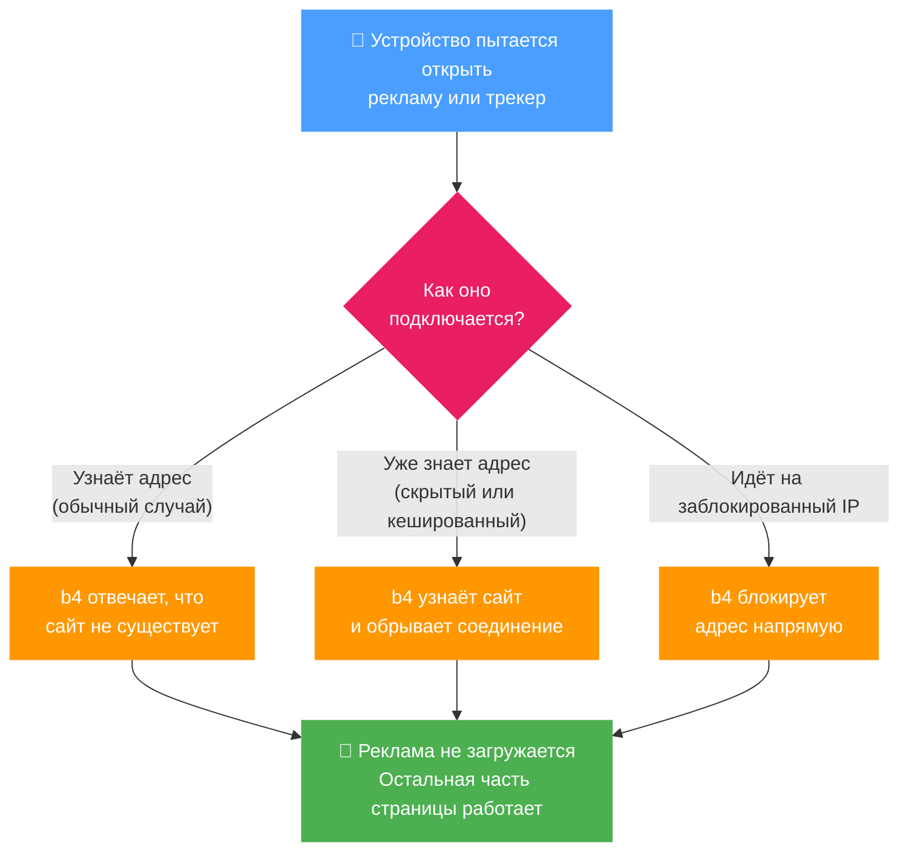

# Блокировка

Режим блокировки останавливает трафик, совпавший с целями сета, вместо того чтобы куда-либо его направлять. Укажите в целях сета домены рекламы и трекеров, нежелательные IP или категорию GeoSite - и b4 заблокирует их во всей сети: на каждом устройстве LAN и на самом роутере, без выходного интерфейса и upstream-прокси.

Выбирается на вкладке [Маршрутизация](./routing.md) как режим **Блокировка**.

## Как это работает

Каким бы способом устройство ни пыталось добраться до заблокированного сайта, b4 его останавливает - и только этот сайт, поэтому остальная часть страницы продолжает работать.



### Как это работает (подробно)

1. **Блокировка на уровне DNS (домены).** Когда устройство запрашивает домен из сета, b4 сам отвечает на запрос «не существует» (NXDOMAIN). Имя не разрешается в адрес, поэтому устройство вообще не может к нему подключиться. Это основной уровень, и он охватывает каждое устройство в сети, чей DNS проходит через роутер.

2. **Блокировка соединения (домены).** Если у устройства уже есть адрес - например, оно использует шифрованный DNS, который b4 не видит, или кешированный результат - b4 всё равно читает имя назначения из TLS- или QUIC-рукопожатия (SNI) и завершает соединение, когда это имя есть в сете. Это сохраняет блокировку рабочей, даже когда уровень DNS обойдён.

3. **Блокировка по адресу (IP).** Цели, заданные как обычные IP, диапазоны CIDR или категория GeoIP, блокируются в файрволе по адресу назначения.

Поскольку первые два уровня работают по **имени**, режим блокировки не ломает посторонние сайты, которые оказались на тех же серверах, что и заблокированный хост - частая проблема при блокировке только по IP-адресу на общих CDN.

Изменения применяются на лету, без перезапуска.

## Настройка

1. Откройте вкладку [Маршрутизация](./routing.md) сета
2. Установите **Режим** в **Блокировка**
3. Выберите **Действие блокировки** (см. ниже)
4. Добавьте назначения для блокировки в [Цели](./targets.md) сета

Выходной интерфейс или upstream-прокси не нужны.

## Действия блокировки

| Действие | Что видит устройство |
| --- | --- |
| **Отклонить** (по умолчанию) | Соединение сразу завершается ошибкой - TCP reset для TCP или ICMP unreachable для UDP и QUIC. Лучший вариант для рекламы и трекеров: страница сразу отказывается от слота. |
| **Отбросить** | Соединение молча поглощается и просто завершается по таймауту. Используйте, когда нужно вообще не отправлять ответ. |

## Цели

Режим блокировки использует те же [цели](./targets.md), что и остальные режимы маршрутизации:

- **Домены** - точные имена или шаблоны `regexp:`
- **IP и диапазоны CIDR** - отдельные адреса или подсети
- **Категории GeoSite** - например, `category-ads-all` для готового списка рекламы и трекеров
- **Категории GeoIP** - блокировка по стране или ASN

## Готовый блокировщик рекламы

Чтобы начать блокировку без ручного добавления доменов, импортируйте готовый сет. На странице [Сеты](./index.md) создайте новый сет, откройте его вкладку **Импорт/Экспорт** и вставьте конфигурацию ниже. Сет нацелен на широкий список доменов рекламы и трекеров плюс категорию GeoSite `category-ads-all`, режим уже установлен в Блокировка.

```json
{"b4_version":"1.65.0","name":"adblock","fragmentation":{"strategy":"none"},"faking":{"sni":false},"targets":{"sni_domains":["ad.mail.ru","advertronic.io","vu.okcdn.ru","adkernel.com","adfox.ru","nr-data.net","rubiconproject.com","adition.com","mc.yandex.com","log.strm.yandex.ru","analytics.yahoo.com","criteo.com","taboola.com","ad4m.at","1rx.io","hbx.media.net","media.net","adform.net","analyticsengine.s3.amazonaws.com","analytics.s3.amazonaws.com","ad.doubleclick.net","analytics.google.com","api.bugsnag.com","app.bugsnag.com","browser.sentry-cdn.com","app.getsentry.com","ads-api.twitter.com","log.byteoversea.com","log.fc.yahoo.com","adtech.yahooinc.com","appmetrica.yandex.ru","metrika.yandex.ru","fingerprintjs.com","px.srvcs.tumblr.com","device-metrics-us.amazon.com","cdn.cookielaw.org","consent.cookiebot.com","sdk.privacy-center.org","cdn.privacy-mgmt.com","api.impact.com","cdn.dynamicyield.com","widget.intercom.io","bnc.lt","bingads.microsoft.com","ads.microsoft.com","snap.licdn.com","ct.pinterest.com","geolocation.onetrust.com","consent.trustarc.com","app.usercentrics.eu","advertising-api-eu.amazon.com","fls-na.amazon.com","advertising.yandex.ru","ironsource.mobi","is.com","pangleglobal.com","posthog.com","o0.ingest.sentry.io","lr-ingest.com","mineralt.io","pixel.quora.com","qevents.quora.com","ads.vk.com","advertising.apple.com","ads.huawei.com","ngfts.lge.com","xp.apple.com","cmp.osano.com","consentcdn.cookiebot.com","zenaps.com","clientstream.launchdarkly.com","match.adsrvr.org","smartyads.com","adcolony.com","mouseflow.com","edge.fullstory.com","stats.wp.com","adsrvr.org","c.bing.com","app-measurement.com","cdn.segment.com","quantcast.com","rudderstack.com","snowplowanalytics.com","adjust.com","singular.net","wzrkt.com","ads.pinterest.com","ads.x.com","ads-sg.tiktok.com","tracking.rus.miui.com","cookiebot.com"],"ip":["5.255.255.77/32"],"geosite_categories":["category-ads-all"]},"enabled":true,"routing":{"enabled":true,"mode":"block"}}
```

Для работы части с `category-ads-all` нужна загруженная база GeoSite - см. [Цели](./targets.md).

## Охват

Режим блокировки действует на всю сеть: он останавливает совпавшие назначения для каждого устройства в сети и для самого роутера. Ему не нужны выходной интерфейс, таблица маршрутизации или прокси, поэтому он работает на любой конфигурации, которую поддерживают остальные режимы маршрутизации.

:::tip
Быстрый блокировщик рекламы для всей сети: создайте сет, добавьте категорию GeoSite `category-ads-all` в его [Цели](./targets.md), установите режим маршрутизации **Блокировка** и оставьте действие **Отклонить**.
:::

:::info
Блокировка по имени требует, чтобы DNS устройства или его TLS/QUIC-рукопожатие проходили через роутер. Трафик, который уходит из сети через отдельный туннель, не видимый роутеру (например, VPN, настроенный прямо на устройстве), находится вне досягаемости b4.
:::
