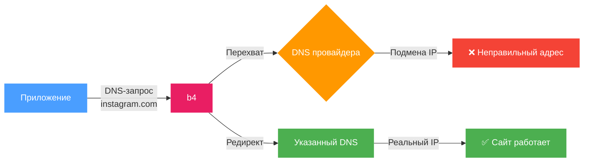
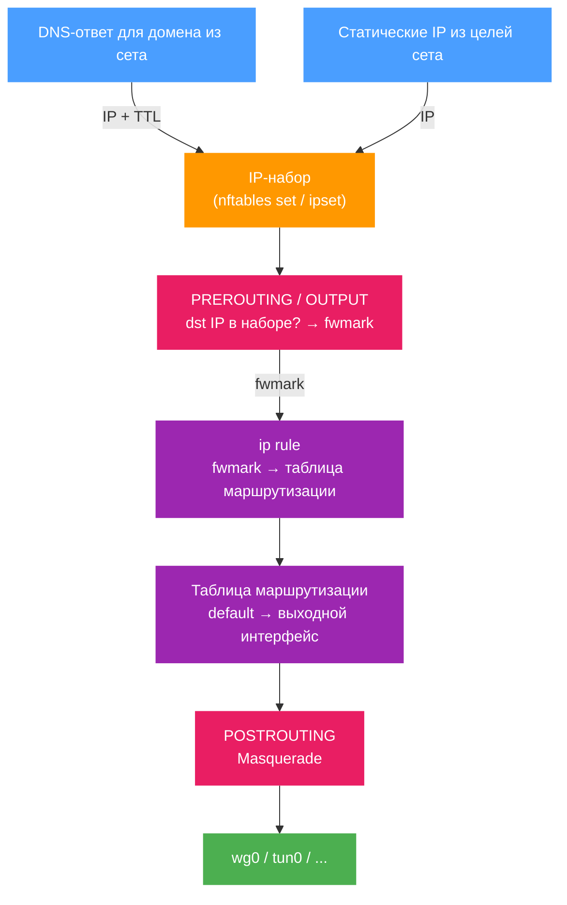

# Маршрутизация

Вкладка маршрутизации управляет тем, как обрабатываются DNS-запросы и куда направляется трафик, совпавший с целями сета. Содержит два раздела: **DNS-редирект** и **Маршрутизация трафика**.

## DNS-редирект

Перенаправляет DNS-запросы для доменов из сета на указанный DNS-сервер.

Некоторые провайдеры перехватывают DNS-ответы и подменяют IP-адреса (DNS poisoning). В результате подключение идёт на неправильный адрес, даже если домен не заблокирован напрямую. DNS-редирект отправляет запрос на альтернативный сервер, минуя перехват.



### Настройка

1. Включите **DNS-редирект**
2. Выберите DNS-сервер из списка или введите IP вручную

:::tip
Если не знаете, какой DNS выбрать - начните с любого из списка, кроме Google DNS (8.8.8.8). Google DNS блокируется некоторыми провайдерами в первую очередь.
:::

### Список серверов

В интерфейсе отображается список DNS-серверов с иконками:

| Иконка | Значение |
| --- | --- |
| ⚡ | Fast - ориентирован на скорость |
| 🛑 | AdBlock - блокирует рекламные домены |
| 🔒 | DNSSEC - криптографическая проверка ответов |

При выборе сервера его IP автоматически подставляется в поле. Можно ввести любой другой IP вручную.

:::warning
Если поле DNS-сервера пустое, редирект не будет работать, даже если он включён.
:::

### Фрагментация DNS-запроса

Переключатель **Фрагментировать запрос** разбивает DNS-пакет на несколько частей перед отправкой.

Используется, если провайдер анализирует содержимое DNS-пакетов даже к сторонним серверам и блокирует запросы по содержимому.

:::info
Фрагментация затрагивает только DNS-запросы доменов из текущего сета. Остальной DNS-трафик не изменяется.
:::

---

## Маршрутизация трафика

Направляет трафик, совпавший с целями сета, через указанный сетевой интерфейс - например, VPN, WireGuard или другой туннель.

:::tip
Чтобы **заблокировать** совпавший трафик вместо того, чтобы куда-либо его направлять, установите режим Блокировка. См. [Блокировка](./blocking.md).
:::

### Общая схема



### Как это работает (подробно)

Маршрутизация использует policy-based routing - маршрутизацию на основе меток пакетов:

1. **Сбор IP-адресов.** Когда b4 видит DNS-ответ для домена из сета, он извлекает из него IP-адреса и добавляет их во внутренний IP-набор (nftables set или ipset). IP-адреса, указанные вручную в [целях сета](./targets.md), добавляются при загрузке конфигурации.

2. **Маркировка пакетов.** b4 создаёт цепочки в firewall для каждого сета:
   - **PREROUTING** (mangle) - маркирует транзитный трафик (от устройств в сети), если IP назначения есть в наборе. Если указаны исходные интерфейсы - маркирует только трафик с этих интерфейсов.
   - **OUTPUT** (mangle) - маркирует трафик от самого роутера.

3. **Policy routing.** Для маркированных пакетов создаётся правило `ip rule`: пакеты с определённым `fwmark` направляются в отдельную таблицу маршрутизации, где default route указывает на выходной интерфейс.

4. **Masquerade.** В цепочке **POSTROUTING** (nat) ко всему маркированному трафику, выходящему через целевой интерфейс, применяется masquerade - исходный IP пакета заменяется на IP выходного интерфейса. Это необходимо, чтобы ответные пакеты возвращались через тот же туннель.

5. **Предварительное разрешение.** При включении маршрутизации b4 сразу резолвит все домены из целей сета и добавляет полученные IP в набор. Это обеспечивает маршрутизацию с первого запроса, не дожидаясь DNS-трафика через NFQUEUE.

### Настройка

1. Включите **Маршрутизацию**
2. Выберите **Исходные интерфейсы** - с каких интерфейсов перехватывать трафик
3. Выберите **Выходной интерфейс** - куда направить трафик


После включения в верхней части раздела отображается диаграмма потока:

```text
[Исходные интерфейсы] → B4 → [Выходной интерфейс] → Интернет
```

Диаграмма обновляется при изменении настроек.

### Исходные интерфейсы

Определяют, с каких сетевых интерфейсов перехватывать трафик для маршрутизации. Отображаются как кнопки-бейджи - клик включает/выключает интерфейс.

:::info
Если ни один исходный интерфейс не выбран - маршрутизация применяется ко всему трафику, включая трафик от самого роутера.
:::

Если ранее выбранный интерфейс исчез из системы (например, VPN-подключение разорвалось), он отображается красным с пометкой «stale».

### Выходной интерфейс

Сетевой интерфейс, через который будет отправлен маркированный трафик:

| Интерфейс | Описание |
| --- | --- |
| `wg0`, `wg1` | WireGuard-туннель |
| `tun0`, `tun1` | OpenVPN-туннель |
| `ppp0` | PPP-соединение |

:::warning
Если выбранный выходной интерфейс перестал быть доступен, появится предупреждение. Маршрутизация не будет работать, пока интерфейс не появится снова.
:::

### IP TTL (время жизни записи)

Определяет, сколько секунд IP-адрес, полученный из DNS-ответа, хранится в IP-наборе маршрутизации. По истечении TTL запись удаляется автоматически.

Значение по умолчанию: **3600** секунд (1 час).

IP-адреса, добавленные вручную в целях сета, также получают этот TTL и обновляются при каждой синхронизации конфигурации.

:::tip
Для стабильных сервисов с постоянными IP можно увеличить TTL. Для CDN-сервисов, где IP меняются часто, лучше уменьшить.
:::

### Firewall backend

b4 автоматически определяет доступный backend:

| Backend | Требования | Описание |
| --- | --- | --- |
| **nftables** | бинарник `nft` | Создаёт таблицу `b4_route` с цепочками `prerouting`, `output`, `postrouting`. IP-наборы с поддержкой `interval` и `timeout`. |
| **iptables + ipset** | бинарники `iptables`, `ipset` | Использует таблицы `mangle` и `nat`. Создаёт ipset типа `hash:net` для хранения IP. Также проверяет `iptables-legacy`. |

:::info
Выбор backend происходит автоматически. На системах с nftables используется nftables, на старых системах - iptables. Ручная настройка не требуется.
:::

### FWMark и таблица маршрутизации

Каждому выходному интерфейсу автоматически назначаются:

- **fwmark** - метка пакета (диапазон `0x100`–`0x7EFF`)
- **routing table** - номер таблицы маршрутизации (диапазон `100`–`2099`)

Значения вычисляются на основе имени интерфейса и остаются стабильными между перезагрузками. Если несколько сетов используют один и тот же выходной интерфейс - они разделяют `fwmark` и таблицу.

:::info
Ручное указание `fwmark` и `table` доступно через конфигурационный файл. В этом случае автоматическое назначение не используется.
:::

### Очистка

При отключении маршрутизации или удалении сета b4 полностью удаляет все созданные правила:

- Удаляет `ip rule` и записи в таблице маршрутизации
- Удаляет jump-правила из базовых цепочек
- Очищает и удаляет созданные цепочки и IP-наборы

При полной остановке b4 выполняется очистка обоих backend (nftables и iptables) для удаления возможных остаточных правил.
